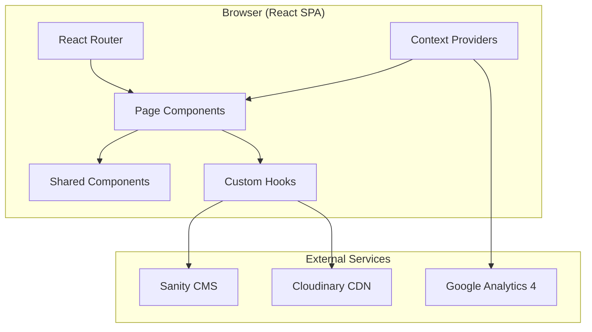
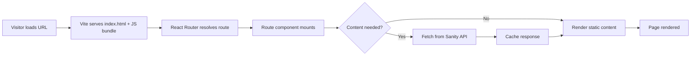

# Design Document: Natfest React Rebuild

## Overview

This design covers the rebuild of the Natfest charity music festival website from a static HTML/CSS/JS site into a modern React single-page application. The rebuild preserves all existing functionality (countdown timer, FAQ accordion, gallery lightbox, scrolling lineup banner, mobile sidebar navigation) while introducing a headless CMS for content management, cloud-based image storage for the gallery, UK-compliant cookie consent, and analytics integration.

The site serves a charity festival audience — visitors looking for lineup information, FAQs, tickets, and gallery photos. The technical goals are: improved developer experience through component-based architecture, content independence for non-technical editors via a CMS, WCAG AA accessibility compliance, and strong performance on mobile connections.

### Key Design Decisions

| Decision | Choice | Rationale |
|----------|--------|-----------|
| Build tool | Vite | Fast HMR, zero-config React support, efficient production builds |
| Router | React Router v6 | Industry standard SPA routing, supports nested routes for lineup years |
| CMS | Sanity | Generous free tier, excellent React integration, real-time preview, flexible schema, and customisable Studio for non-technical editors |
| Image storage | Cloudinary | Free tier covers the gallery needs, automatic format/quality optimisation, responsive image transforms via URL parameters, React SDK available |
| Styling | CSS Modules + CSS custom properties | Preserves existing design tokens, scoped styles without runtime cost, easy migration from current CSS |
| State management | React Context + hooks | No global state complexity needed — CMS data is fetched per-route, only cookie consent state is truly global |
| Analytics | Google Analytics 4 (gtag.js) | Free, widely supported, event-based model fits the requirements |
| Deployment | Netlify or Vercel | Free tier for static/SPA hosting, automatic HTTPS, GitHub integration, custom domain support (existing CNAME) |
| Cookie consent | Custom implementation | Simple two-button banner — no need for a heavy third-party library for this scope |

---

## Architecture

### High-Level Architecture



### Application Flow



### Project Structure

```
natfest-react/
├── public/
│   ├── _redirects              # SPA fallback for Netlify
│   └── fonts/                  # Self-hosted Quicksand if needed
├── src/
│   ├── main.jsx                # Entry point, wraps App with providers
│   ├── App.jsx                 # Router configuration
│   ├── components/
│   │   ├── layout/
│   │   │   ├── Header.jsx
│   │   │   ├── Footer.jsx
│   │   │   ├── Navigation.jsx
│   │   │   ├── SidebarNav.jsx
│   │   │   └── Layout.jsx      # Shared page shell
│   │   ├── countdown/
│   │   │   └── CountdownTimer.jsx
│   │   ├── banner/
│   │   │   └── LineupBanner.jsx
│   │   ├── gallery/
│   │   │   ├── GalleryGrid.jsx
│   │   │   ├── GalleryModal.jsx
│   │   │   └── GalleryFilter.jsx
│   │   ├── faq/
│   │   │   ├── FaqAccordion.jsx
│   │   │   └── FaqItem.jsx
│   │   ├── lineup/
│   │   │   ├── ActCard.jsx
│   │   │   └── StageSection.jsx
│   │   ├── about/
│   │   │   ├── TeamMember.jsx
│   │   │   └── LorosLetter.jsx
│   │   ├── cookie/
│   │   │   └── CookieBanner.jsx
│   │   └── common/
│   │       ├── Image.jsx        # Cloudinary-aware image wrapper
│   │       ├── ErrorBoundary.jsx
│   │       └── SkipLink.jsx
│   ├── pages/
│   │   ├── HomePage.jsx
│   │   ├── AboutPage.jsx
│   │   ├── LineupPage.jsx       # Landing with year links
│   │   ├── LineupYearPage.jsx   # Specific year lineup
│   │   ├── VendorsPage.jsx
│   │   ├── GalleryPage.jsx
│   │   ├── TicketsPage.jsx
│   │   ├── FaqsPage.jsx
│   │   ├── PartnersPage.jsx
│   │   ├── PrivacyPolicyPage.jsx
│   │   └── CookiePolicyPage.jsx
│   ├── hooks/
│   │   ├── useSanityQuery.js    # Generic Sanity fetch + cache hook
│   │   ├── useCountdown.js      # Countdown calculation logic
│   │   ├── useGallery.js        # Gallery pagination + filtering
│   │   ├── useCookieConsent.js  # Cookie preference logic
│   │   └── useFocusTrap.js      # Focus trapping for modals/sidebar
│   ├── context/
│   │   ├── CookieConsentContext.jsx
│   │   └── AnalyticsContext.jsx
│   ├── lib/
│   │   ├── sanityClient.js      # Sanity client configuration
│   │   ├── cloudinary.js        # Cloudinary URL builder
│   │   ├── analytics.js         # GA4 helper functions
│   │   └── constants.js         # Event date, site metadata
│   ├── styles/
│   │   ├── global.css           # Reset, CSS variables, base typography
│   │   ├── Header.module.css
│   │   ├── Footer.module.css
│   │   ├── Gallery.module.css
│   │   ├── Faq.module.css
│   │   └── ...                  # One module per component
│   └── assets/
│       └── images/              # Static assets (logo, icons)
├── sanity/                      # Sanity Studio (can be separate repo)
│   ├── schemas/
│   │   ├── act.js
│   │   ├── vendor.js
│   │   ├── teamMember.js
│   │   ├── faq.js
│   │   └── siteSettings.js
│   └── sanity.config.js
├── index.html
├── vite.config.js
├── package.json
└── .env.example
```

---

## Components and Interfaces

### Layout Components

#### `Layout`
Wraps every page. Renders Header, CountdownTimer, LineupBanner, the page content (via `<Outlet />`), and Footer.

```jsx
// Props: none (uses Outlet from React Router)
<Layout>
  <Header />
  <SecondaryHeader>
    <CountdownTimer targetDate={EVENT_DATE} />
    <LineupBanner />
  </SecondaryHeader>
  <main>
    <Outlet />
  </main>
  <Footer />
  <CookieBanner />
</Layout>
```

#### `Header`
- Renders the Natfest logo image, social media badge links (Facebook, Instagram), and the desktop `<Navigation />`.
- Renders `<SidebarNav />` and the hamburger toggle button for mobile.

#### `Navigation`
- Renders `<nav><ul>` with links to all pages.
- Uses `NavLink` from React Router for automatic `aria-current="page"` and active class.

#### `SidebarNav`
- Receives `isOpen` and `onClose` props.
- Uses `useFocusTrap` hook when open.
- Closes on Escape keypress.
- Transitions via CSS `transform: translateX()`.

#### `Footer`
- Renders Privacy Policy, Cookie Policy, Instagram, Facebook links.
- LOROS charity logo with external link.
- All external links have `target="_blank" rel="noopener noreferrer"`.

### Interactive Components

#### `CountdownTimer`
```typescript
interface CountdownTimerProps {
  targetDate: string; // ISO 8601 date string
}
```
- Uses `useCountdown` hook which runs `setInterval` at 1000ms.
- Renders days/hours/minutes/seconds or "It's Natfest time!" when past.
- Wraps the updating value in an `aria-live="polite"` region.

#### `LineupBanner`
```typescript
interface LineupBannerProps {
  acts?: string[]; // Falls back to CMS data via hook
}
```
- CSS animation with duplicated content for seamless loop.
- Pauses on hover/focus.
- Respects `prefers-reduced-motion` (shows static text).
- `role="region"` with `aria-label`, duplicated elements get `aria-hidden="true"`.

#### `FaqAccordion`
```typescript
interface FaqAccordionProps {
  items: Array<{ id: string; question: string; answer: string }>;
}
```
- Renders a list of `FaqItem` components.
- Multiple sections can be open simultaneously.

#### `FaqItem`
```typescript
interface FaqItemProps {
  id: string;
  question: string;
  answer: string;
  isOpen: boolean;
  onToggle: () => void;
}
```
- `<button aria-expanded={isOpen} aria-controls={panelId}>` for the question.
- `<div id={panelId} role="region" hidden={!isOpen}>` for the answer.

#### `GalleryGrid`
```typescript
interface GalleryGridProps {
  category: 'all' | 'acts' | 'crowd';
}
```
- Uses `useGallery` hook for pagination (20 images per batch).
- Renders thumbnails via `<Image />` component with Cloudinary transforms.
- Intersection observer triggers next batch load.

#### `GalleryModal`
```typescript
interface GalleryModalProps {
  images: GalleryImage[];
  currentIndex: number;
  isOpen: boolean;
  onClose: () => void;
  onPrev: () => void;
  onNext: () => void;
}
```
- Focus trap when open.
- Keyboard navigation: Escape closes, ArrowLeft/ArrowRight navigates.
- Renders full-resolution Cloudinary image with medium fallback on error.

#### `CookieBanner`
```typescript
interface CookieBannerProps {} // Uses CookieConsentContext
```
- Appears only when no preference stored.
- Two buttons: "Accept" and "Reject" with equal visual prominence.
- Never auto-dismisses.
- No pre-ticked options.

### Utility Components

#### `Image`
```typescript
interface ImageProps {
  publicId: string;       // Cloudinary public ID
  alt: string;
  width?: number;
  height?: number;
  variant?: 'thumbnail' | 'medium' | 'full';
  loading?: 'lazy' | 'eager';
  fallback?: string;
}
```
- Builds Cloudinary URL with appropriate transforms.
- Uses `<picture>` with WebP/AVIF sources and JPEG fallback.
- Shows placeholder on error.

#### `SkipLink`
- "Skip to main content" link, visible on focus, positioned before Header.

---

## Data Models

### Sanity CMS Schemas

#### `act`
```javascript
{
  name: 'act',
  title: 'Lineup Act',
  type: 'document',
  fields: [
    { name: 'name', type: 'string', validation: Rule => Rule.required().max(100) },
    { name: 'description', type: 'text', validation: Rule => Rule.max(500) },
    { name: 'image', type: 'image', options: { hotspot: true } },
    { name: 'stage', type: 'string', options: { list: ['Main Stage', 'Marquee Stage'] }, validation: Rule => Rule.required() },
    { name: 'year', type: 'number', validation: Rule => Rule.required() },
    { name: 'performanceOrder', type: 'number', validation: Rule => Rule.required().min(1) },
    { name: 'isHeadliner', type: 'boolean', initialValue: false },
    { name: 'links', type: 'array', of: [{ type: 'url' }], validation: Rule => Rule.max(5) }
  ]
}
```

#### `vendor`
```javascript
{
  name: 'vendor',
  title: 'Vendor',
  type: 'document',
  fields: [
    { name: 'name', type: 'string', validation: Rule => Rule.required().max(100) },
    { name: 'description', type: 'text', validation: Rule => Rule.max(300) },
    { name: 'category', type: 'string', options: { list: [] } }, // Populated via CMS settings
    { name: 'image', type: 'image', options: { hotspot: true } }
  ]
}
```

#### `teamMember`
```javascript
{
  name: 'teamMember',
  title: 'Team Member',
  type: 'document',
  fields: [
    { name: 'name', type: 'string', validation: Rule => Rule.required().max(100) },
    { name: 'bio', type: 'text', validation: Rule => Rule.max(500) },
    { name: 'photo', type: 'image', options: { hotspot: true } },
    { name: 'displayOrder', type: 'number', validation: Rule => Rule.required().min(1) }
  ]
}
```

#### `faq`
```javascript
{
  name: 'faq',
  title: 'FAQ',
  type: 'document',
  fields: [
    { name: 'question', type: 'string', validation: Rule => Rule.required() },
    { name: 'answer', type: 'array', of: [{ type: 'block' }] }, // Rich text for links, bold, etc.
    { name: 'order', type: 'number' }
  ]
}
```

#### `siteSettings`
```javascript
{
  name: 'siteSettings',
  title: 'Site Settings',
  type: 'document',
  fields: [
    { name: 'eventDate', type: 'datetime' },
    { name: 'lorosLetterIntro', type: 'text' },
    { name: 'lorosLetterFull', type: 'array', of: [{ type: 'block' }] },
    { name: 'vendorCategories', type: 'array', of: [{ type: 'string' }] }
  ]
}
```

#### `galleryImage`
```javascript
{
  name: 'galleryImage',
  title: 'Gallery Image',
  type: 'document',
  fields: [
    { name: 'title', type: 'string' },
    { name: 'category', type: 'string', options: { list: ['Acts', 'Crowd'] }, validation: Rule => Rule.required() },
    { name: 'cloudinaryPublicId', type: 'string', validation: Rule => Rule.required() },
    { name: 'alt', type: 'string' },
    { name: 'year', type: 'number' },
    { name: 'order', type: 'number' }
  ]
}
```

### Client-Side Types

```typescript
interface GalleryImage {
  id: string;
  publicId: string;
  alt: string;
  category: 'Acts' | 'Crowd';
  year: number;
  thumbnailUrl: string;
  mediumUrl: string;
  fullUrl: string;
}

interface Act {
  id: string;
  name: string;
  description: string;
  imageUrl: string;
  stage: 'Main Stage' | 'Marquee Stage';
  year: number;
  performanceOrder: number;
  isHeadliner: boolean;
  links: string[];
}

interface Vendor {
  id: string;
  name: string;
  description: string;
  category: string;
  imageUrl: string;
}

interface TeamMember {
  id: string;
  name: string;
  bio: string;
  photoUrl: string;
  displayOrder: number;
}

interface CookiePreference {
  analytics: boolean;
  timestamp: number;
}
```

### Cloudinary URL Structure

Gallery images are stored in Cloudinary with a folder structure:

```
natfest/gallery/acts/{imageId}
natfest/gallery/crowd/{imageId}
```

URLs are built dynamically with transforms:

| Variant | Transform | Max dimension |
|---------|-----------|--------------|
| Thumbnail | `c_fill,w_400,h_267,f_auto,q_auto` | 400px |
| Medium | `c_limit,w_1200,f_auto,q_auto` | 1200px |
| Full | `c_limit,w_2400,f_auto,q_auto` | 2400px |

The `f_auto` parameter automatically serves WebP/AVIF to supported browsers with JPEG fallback.

---

## Error Handling

### CMS Content Failures

| Scenario | Behaviour |
|----------|-----------|
| Sanity API returns error | Display cached content from previous successful fetch (stored in `sessionStorage`) |
| Sanity API timeout (>5s) | Same as error — show cached content |
| No cached content available | Display a user-friendly message: "Content is temporarily unavailable. Please try again shortly." |
| Individual field missing | Render component with available data; omit missing optional fields |

### Gallery Image Failures

| Scenario | Behaviour |
|----------|-----------|
| Batch load fails | Show error message with retry button; retry up to 3 times |
| Individual thumbnail fails | Show placeholder (grey box with image icon) |
| Full-res image fails in modal | Attempt medium-size fallback; if that fails, show error indicator but keep navigation working |
| Cloudinary service unavailable | Same as batch failure — error message + retry |

### Analytics Failures

| Scenario | Behaviour |
|----------|-----------|
| GA4 script fails to load (5s timeout) | Application continues without analytics; no error shown to visitor |
| Event tracking call fails | Silently swallowed; does not affect user experience |

### General Error Boundary

Each page wrapped in `<ErrorBoundary>` component that catches render errors and displays a fallback UI with a "Reload page" option, preventing the entire app from crashing.

---

## Testing Strategy

### PBT Applicability Assessment

This feature is primarily a **UI rendering and CMS integration project**. The bulk of the work involves:
- React component rendering (UI)
- Fetching and displaying CMS content (CRUD + rendering)
- Image gallery display with external CDN (integration)
- Cookie consent state management (simple boolean state)
- CSS animations and responsive layouts (visual)

Most acceptance criteria describe UI behaviour, visual states, or external service integration. However, there are a few areas with **pure logic** suitable for property-based testing:

1. **Countdown timer calculation** — pure function converting a target date and current time into days/hours/minutes/seconds
2. **Cloudinary URL building** — pure function mapping (publicId, variant, options) → URL string
3. **Gallery filtering and pagination** — pure data transformation filtering images by category and slicing into batches
4. **Cookie consent state machine** — deterministic state transitions

These are worth testing with PBT. The remaining acceptance criteria are best covered by example-based unit tests and integration tests.

### Unit Testing

#### Framework and Tooling

- **Test runner:** Vitest — fast, Vite-native, Jest-compatible API, supports ESM and TypeScript out of the box
- **Component testing:** React Testing Library (`@testing-library/react`) for rendering components and asserting DOM output in a user-centric way
- **User event simulation:** `@testing-library/user-event` for realistic interaction simulation (clicks, keyboard, focus)
- **Mocking:** MSW (Mock Service Worker) for intercepting API/network calls; `vi.mock()` for module-level mocking (e.g. Cloudinary SDK, router hooks)
- **Coverage:** Istanbul via Vitest's built-in `--coverage` flag

#### Configuration

- Coverage target: **80%+ on business logic, hooks, and utility functions**; components measured but not gated (UI rendering is better validated visually)
- Test file convention: **co-located** `*.test.tsx` / `*.test.ts` files alongside their source (e.g. `CountdownTimer.test.tsx` next to `CountdownTimer.jsx`)
- Runs in jsdom environment (configured in `vite.config.ts` or `vitest.config.ts`)

#### Mocking Strategy

| Dependency | Mock approach |
|------------|--------------|
| Sanity API calls | MSW request handlers returning fixture data |
| Cloudinary image URLs | `vi.mock('../lib/cloudinary')` returning deterministic URLs |
| Google Analytics (gtag) | `vi.mock('../lib/analytics')` with spy functions |
| React Router context | `MemoryRouter` wrapper with pre-set routes |
| `IntersectionObserver` | Polyfill/mock in test setup (jsdom lacks native support) |
| `window.matchMedia` | Mock in setup to simulate `prefers-reduced-motion` and viewport queries |
| Timers (`setInterval`) | `vi.useFakeTimers()` for countdown and animation tests |

#### What to Test per Component Type

**Layout components** (Header, Footer, Layout, Navigation):
- Renders expected navigation links and logo
- Conditional rendering based on viewport (desktop nav visible / hamburger hidden at ≥768px and vice versa)
- Active link styling applied for the current route
- External links have correct `target` and `rel` attributes
- Footer renders LOROS logo with alt text fallback

**Interactive components** (SidebarNav, FaqAccordion, GalleryModal, CookieBanner):
- User interactions fire correct handlers (click, Enter, Space, Escape)
- ARIA states update correctly (`aria-expanded`, `aria-current`, `aria-hidden`)
- Focus management: focus moves to correct element on open/close
- Keyboard-only operability (Tab, Escape, Arrow keys where applicable)

**Hooks** (useCountdown, useGallery, useCookieConsent, useFocusTrap, useSanityQuery):
- Return values are correct for given inputs
- State changes in response to actions (e.g. `useCountdown` updates every tick with fake timers)
- Error states handled (hook returns error/fallback when API fails)
- Cleanup on unmount (intervals cleared, event listeners removed)

**Utility / pure functions** (Cloudinary URL builder, analytics helpers, constants):
- Pure input → output validation
- Edge cases: empty strings, missing parameters, invalid inputs

#### Key Test Scenarios by Component

| Component | Key scenarios |
|-----------|--------------|
| **CountdownTimer** | Displays correct d/h/m/s for a future date; shows "It's Natfest time!" when past; updates every second (fake timers); aria-live region present |
| **CookieBanner** | Visible when no preference stored; hidden after accept/reject; "Accept" loads analytics; "Reject" blocks analytics; no pre-ticked state; preference persists to cookie |
| **GalleryGrid** | Renders first 20 thumbnails; loads next batch on scroll (mock IntersectionObserver); filters by category; shows error message + retry on fetch failure |
| **GalleryModal** | Opens on thumbnail click with correct image; Escape closes and returns focus; ArrowLeft/ArrowRight navigate; stays on first/last image at boundaries; falls back to medium image on full-res error |
| **FaqAccordion** | All sections collapsed by default; click expands one section; multiple sections open simultaneously; aria-expanded toggles; Enter/Space activate; Tab moves between questions |
| **Navigation** | Desktop: horizontal links visible, hamburger hidden; Mobile: hamburger visible, sidebar hidden; sidebar opens on click with focus trap; Escape closes sidebar; aria-expanded reflects state |
| **LineupBanner** | Renders act names from CMS data; duplicated content has aria-hidden; pauses on hover; pauses on focus; static display when prefers-reduced-motion active |
| **Image** | Renders picture element with WebP/AVIF sources; shows placeholder on load error; applies correct Cloudinary transforms for variant; lazy loading attribute present for below-fold images |
| **LorosLetter** | First paragraph visible, rest hidden; "Read more" expands full content; "Read less" collapses; aria-expanded toggles correctly |
| **ErrorBoundary** | Catches child render errors; displays fallback UI with reload option; does not crash parent tree |

#### CI Integration

All unit tests run on every pull request via **GitHub Actions**. The CI workflow:

1. Installs dependencies (`npm ci`)
2. Runs `vitest --run --coverage` (single execution, no watch mode)
3. Fails the PR if any test fails or coverage drops below the configured threshold
4. Uploads coverage report as a workflow artefact for review

### Integration Tests (Vitest + MSW for mocking)

- Sanity data fetching and cache fallback
- Gallery pagination loading batches
- Analytics event dispatching when consent is given
- Cookie preference persistence and retrieval
- Gallery modal open/close from thumbnail
- Route transitions updating navigation state

### Accessibility Tests

- axe-core automated checks on each page
- Keyboard navigation flow tests (Tab order, Escape, Enter/Space)
- ARIA attribute verification on interactive components
- Focus management tests for modal and sidebar

### Property-Based Tests (fast-check)

Suitable for the pure logic functions identified above:
- Countdown calculation correctness across random date pairs
- Cloudinary URL builder always produces valid URLs
- Gallery filter preserves total image count (all filtered subsets sum to total)
- Cookie state transitions are idempotent and consistent

### Performance Tests

- Lighthouse CI in CI/CD pipeline targeting score ≥ 90 on Home page
- Bundle size budget checks via Vite build analysis

---

## Correctness Properties

*A property is a characteristic or behavior that should hold true across all valid executions of a system — essentially, a formal statement about what the system should do. Properties serve as the bridge between human-readable specifications and machine-verifiable correctness guarantees.*

### Property 1: Countdown calculation correctness

*For any* target date in the future and any current date before it, the countdown calculation SHALL produce non-negative values for days, hours, minutes, and seconds where hours < 24, minutes < 60, seconds < 60, and reconstructing the total milliseconds from these components equals the original difference between the two dates (within 999ms rounding).

**Validates: Requirements 3.1, 3.2**

### Property 2: Countdown expiry display

*For any* target date and any current date that is equal to or after the target date, the countdown SHALL indicate expiry (return the "past" state) rather than negative values.

**Validates: Requirements 3.3**

### Property 3: Cloudinary URL builder produces valid URLs

*For any* valid public ID string and any variant (thumbnail, medium, full), the Cloudinary URL builder SHALL produce a URL string that contains the public ID, includes the appropriate width transform parameter for that variant, and matches the URL pattern `https://res.cloudinary.com/{cloud_name}/image/upload/{transforms}/{publicId}`.

**Validates: Requirements 7.7**

### Property 4: Gallery category filter preserves image set integrity

*For any* list of gallery images with mixed categories, filtering by "Acts" SHALL return only images with category "Acts", filtering by "Crowd" SHALL return only images with category "Crowd", and filtering by "All" SHALL return the complete unfiltered list. In all cases, the filtered results SHALL be a subset of the original list with no duplicates introduced.

**Validates: Requirements 7.8**

### Property 5: Gallery pagination batch size invariant

*For any* list of gallery images of length N and a batch size of 20, paginating the list SHALL produce ceil(N/20) batches where each batch except possibly the last contains exactly 20 items, the last batch contains between 1 and 20 items, and concatenating all batches reproduces the original list in order.

**Validates: Requirements 7.2**

### Property 6: Cookie consent state machine consistency

*For any* sequence of accept/reject actions, the cookie consent state SHALL always be in exactly one of three states: "unset", "accepted", or "rejected". Accepting from any state transitions to "accepted". Rejecting from any state transitions to "rejected". The stored preference SHALL always match the current logical state.

**Validates: Requirements 9.3, 9.4, 9.5, 9.7, 9.8**

